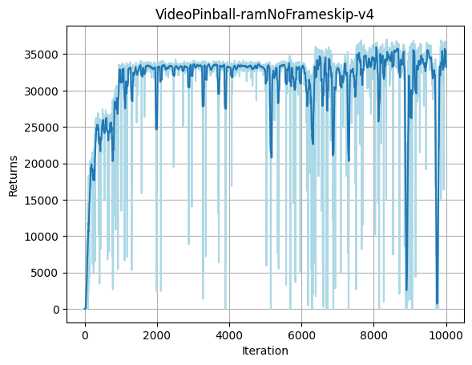
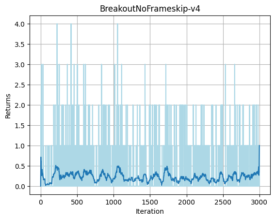
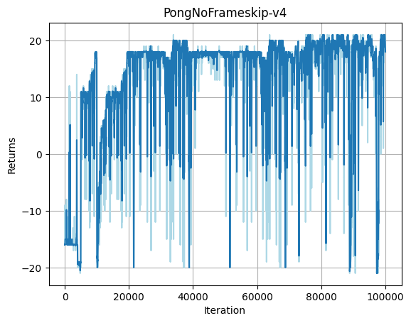
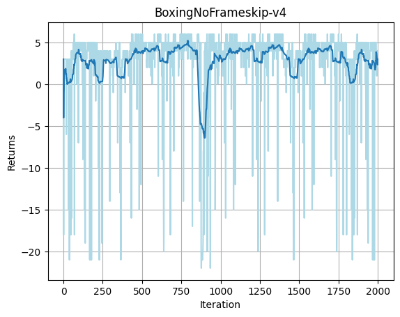
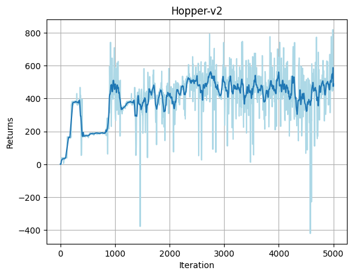

# Learning Strategies with Double DQN and DDPG in the Atari and MuJoCo Environments
This repository contains the source code to reproduce the experiments in the reinforcement learning final project. 
<table>
  <tr>
    <td>
      
    </td>
    <td>
      
    </td>
    <td>
      
    </td>
    <td>
      
    </td>
  </tr>
  <tr>
    <td>
      
    </td>
    <td>
      
    </td>
    <td>
      
    </td>
    <td>
      
    </td>
  </tr>
</table>

## Setup
Run the following command to build the environment:
```angular2html
conda env create -f environment.yml
conda activate rl
```

We conduct experiments in the Atari and MuJoCo environments, please refer to [Atari](https://www.gymlibrary.dev/environments/atari/) and [MuJoCo](https://www.gymlibrary.dev/environments/mujoco/) for more information about the environments.
## Experiments
Run the following command to train from scratch

```angular2html
python run.py --env_name $env_name --to_train
```
Run the following evaluate the ckeckpoint
```angular2html
python run.py --env_name $env_name 
```
Please guarantee your checkpoints are in the folder checkpoints/$env_name

We support the following environments:
- VideoPinball-ramNoFrameskip-v4
- BreakoutNoFrameskip-v4
- PongNoFrameskip-v4
- BoxingNoFrameskip-v4
- Hopper-v2
- Humanoid-v2
- HalfCheetah-v2
- Ant-v2

Our learning curve is as follows:
<table>
  <tr>
    <td>
      
    </td>
    <td>
      
    </td>
  </tr>
  <tr>
    <td>
      
    </td>
    <td>
      
    </td>
  </tr>
  <tr>
    <td>
      
    </td>
    <td>
      
    </td>
  </tr>
  <tr>
    <td>
      
    </td>
    <td>
      
    </td>
  </tr>
</table>
                                                                                   